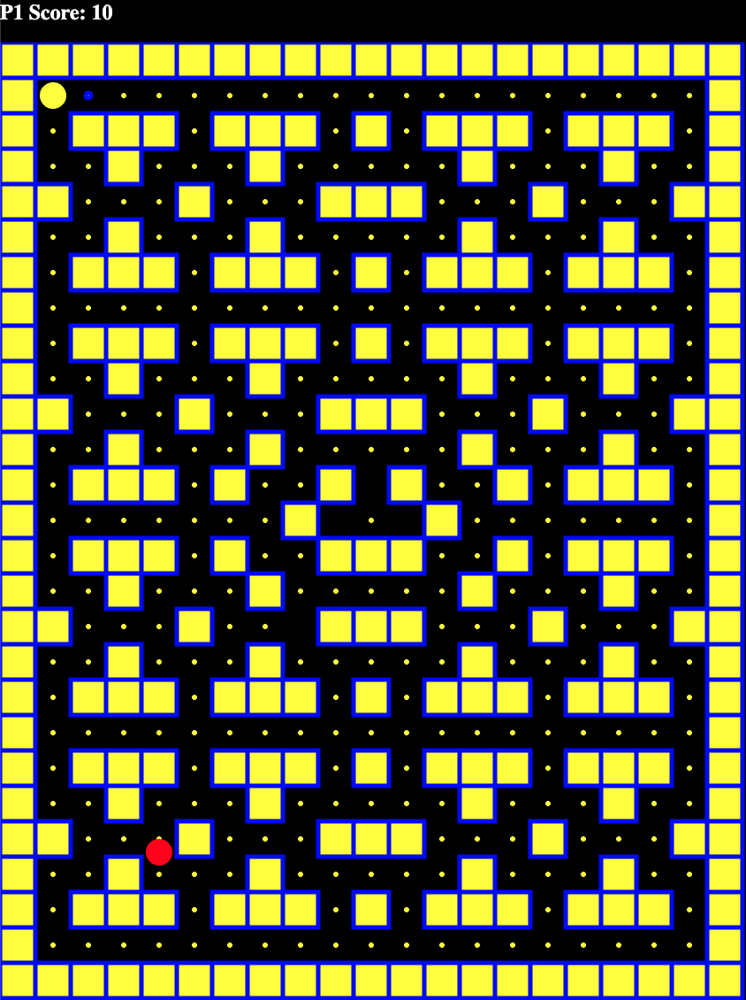

# PACMAN

SEIRFX 221 Project 1: PACMAN

Play the classic PACMAN game!

# HOW TO PLAY

Select 1 player or 2 player from the starting screen.

If single player mode is selected, use `wasd` to move up, left, down, and right. 

Once you eat all the pallets without running into the ghost, then you win the game!

If two player mode is selected, player 1 use `wasd` and player 2 use `arrow key` to move up, left, down, and right.

Who ever gets more pallets without running into the ghost wins the game!

# Start Up Screen:


# Single Player Mode:



# Two player Mode: 


# HOW TO INSTALL

1. `Fork` and `Clone` this repository to your local machine.
2. Open `index.html` in your broser to play or 
3. Open the directory in your text editor of choice to view or edit the code

# HOW IT WORKS
PACMAN can only can move inside of a set boundary which are set through an array of arrays.  
```javascript
const map = [
    ['0', '0', '0', '0', '0', '0', '0', '0', '0', '0', '0', '0', '0', '0', '0', '0', '0', '0', '0', '0', '0'],
    ['0', '.', '.', '.', '.', '.', '.', '.', '.', '.', '.', '.', '.', '.', '.', '.', '.', '.', '.', '.', '0'],
    ['0', '.', '0', '0', '0', '.', '0', '0', '0', '.', '0', '.', '0', '0', '0', '.', '0', '0', '0', '.', '0'],
    ['0', '.', '.', '0', '.', '.', '.', '0', '.', '.', '.', '.', '.', '0', '.', '.', '.', '0', '.', '.', '0'],
    ['0', '0', '.', '.', '.', '0', '.', '.', '.', '0', '0', '0', '.', '.', '.', '0', '.', '.', '.', '0', '0'],
    ['0', '.', '.', '0', '.', '.', '.', '0', '.', '.', '.', '.', '.', '0', '.', '.', '.', '0', '.', '.', '0'],
    ['0', '.', '0', '0', '0', '.', '0', '0', '0', '.', '0', '.', '0', '0', '0', '.', '0', '0', '0', '.', '0'],
    ['0', '.', '.', '.', '.', '.', '.', '.', '.', '.', '.', '.', '.', '.', '.', '.', '.', '.', '.', '.', '0'],
    ['0', '.', '0', '0', '0', '.', '0', '0', '0', '.', '0', '.', '0', '0', '0', '.', '0', '0', '0', '.', '0'],
    ['0', '.', '.', '0', '.', '.', '.', '0', '.', '.', '.', '.', '.', '0', '.', '.', '.', '0', '.', '.', '0'],
    ['0', '0', '.', '.', '.', '0', '.', '.', '.', '0', '0', '0', '.', '.', '.', '0', '.', '.', '.', '0', '0'],
    ['0', '.', '.', '0', '.', '.', '.', '0', '.', '.', '.', '.', '.', '0', '.', '.', '.', '0', '.', '.', '0'],
    ['0', '.', '0', '0', '0', '.', '0', '.', '.', '0', '-', '0', '.', '.', '0', '.', '0', '0', '0', '.', '0'],
    ['0', '.', '.', '.', '.', '.', '.', '.', '0', '-', '.', '-', '0', '.', '.', '.', '.', '.', '.', '.', '0'],
    ['0', '.', '0', '0', '0', '.', '0', '.', '.', '0', '0', '0', '.', '.', '0', '.', '0', '0', '0', '.', '0'],
    ['0', '.', '.', '0', '.', '.', '.', '0', '.', '.', '.', '.', '.', '0', '.', '.', '.', '0', '.', '.', '0'],
    ['0', '0', '.', '.', '.', '0', '.', '.', '.', '0', '0', '0', '.', '.', '.', '0', '.', '.', '.', '0', '0'],
    ['0', '.', '.', '0', '.', '.', '.', '0', '.', '.', '.', '.', '.', '0', '.', '.', '.', '0', '.', '.', '0'],
    ['0', '.', '0', '0', '0', '.', '0', '0', '0', '.', '0', '.', '0', '0', '0', '.', '0', '0', '0', '.', '0'],
    ['0', '.', '.', '.', '.', '.', '.', '.', '.', '.', '.', '.', '.', '.', '.', '.', '.', '.', '.', '.', '0'],
    ['0', '.', '0', '0', '0', '.', '0', '0', '0', '.', '0', '.', '0', '0', '0', '.', '0', '0', '0', '.', '0'],
    ['0', '.', '.', '0', '.', '.', '.', '0', '.', '.', '.', '.', '.', '0', '.', '.', '.', '0', '.', '.', '0'],
    ['0', '0', '.', '.', '.', '0', '.', '.', '.', '0', '0', '0', '.', '.', '.', '0', '.', '.', '.', '0', '0'],
    ['0', '.', '.', '0', '.', '.', '.', '0', '.', '.', '.', '.', '.', '0', '.', '.', '.', '0', '.', '.', '0'],
    ['0', '.', '0', '0', '0', '.', '0', '0', '0', '.', '0', '.', '0', '0', '0', '.', '0', '0', '0', '.', '0'],
    ['0', '.', '.', '.', '.', '.', '.', '.', '.', '.', '.', '.', '.', '.', '.', '.', '.', '.', '.', '.', '0'],
    ['0', '0', '0', '0', '0', '0', '0', '0', '0', '0', '0', '0', '0', '0', '0', '0', '0', '0', '0', '0', '0']
]
```
By using above map and the code below, boundaries are created where PACMAN can move around.

`'0'` represents a box and `'.'` represents a pallet.
```javascript
for (let i = 0; i < map.length; i++) {
    for (let j = 0; j < map[i].length; j++) {
        if (map[i][j] === '0') {
            boxArray.push(new Box({
                position:
                {
                    x: Box.width * j,
                    y: Box.height * i
                }
            }));
        } else if (map[i][j] === '.') {
            dots.push(new Dot({
                position:
                {
                    x: j * Box.width + Box.width / 2,
                    y: i * Box.height + Box.height / 2
                }
            }));

        }
    }
}
```
When ever PACMAN makes contact with a pallet, that pallet is taken out of the `dots` array, disappears from the screen and score goes up by 10 points.

Scores are also reflected at the top of the screen for both players.

Collision between circles are little bit different from collision between circles and straight edge.  

`Math.hypot()` function is used to figuring out the distance between center point of the PACMAN and the pallet.  

Once the distance is known, then we can compare that to sum of pallet and PACMAN's radius to see if PACMAN and pallent is about to collide or not. 

If PACMAN and the pallet made contact, then use `splice` method to take out one pallet each from `dots` array.

Same method is used for collision between the player and the ghost.

Snippet from `eatDots()`:
```javascript
if (Math.hypot(dot.position.x - pacman.position.x, dot.position.y - pacman.position.y) < dot.radius + pacman.radius) {
  dots.splice(i, 1);
  score1 += 10;
  p1Score.innerText = score1;
}
```


# FUTURE CONSIDERATIONS
Should I return to this game in the future, I would like to deploy following aspects:

1. Different difficulties

2. More Ghosts

3. More Maps

4. Animation when PACMAN is ran over by a ghost

5. Power up pallet

6. Tunnel to go to either side

7. Animation for Ghosts
